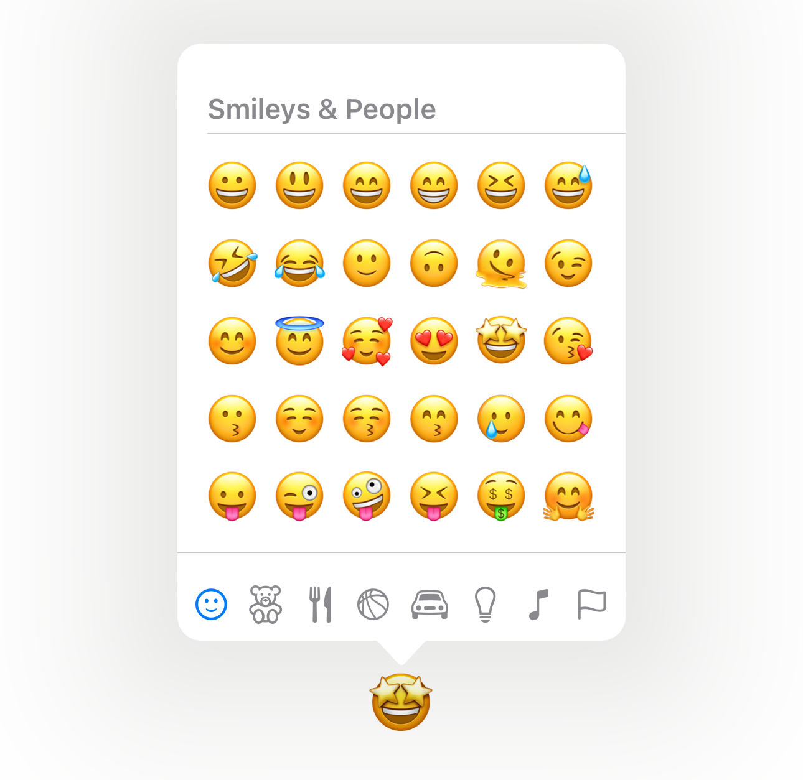

# EmojiPalette

Emoji Picker for iOS using SwiftUI.



## Requirements

- Development with Xcode 14.3.1+
- Written in Swift 5
- swift-tools-version: 5.8
- Compatible with iOS 16.4+

## Usage

```swift
import SwiftUI
import EmojiPalette

struct ContentView: View {
    @State var showPopover: Bool = false
    @State var emoji: String = "💪"

    var body: some View {
        VStack {
            Button {
                showPopover = true
            } label: {
                Text(emoji)
                    .font(.largeTitle)
            }
            .emojiPalette(selectedEmoji: $emoji,
                          isPresented: $showPopover)
        }
        .padding()
    }
}
```

## Localization

- English (en)
- Japanese (ja)
